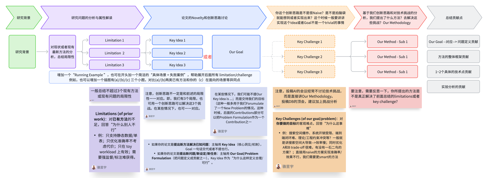

# 3.2 A Thinking Model for Writing the Paper Introduction

> The Introduction is a condensed version of the entire paper.

Generally speaking, the Introduction can be regarded as the "compressed version" of the entire paper: using the least amount of space to clearly explain the research subject, thoroughly explain why the problem is difficult, and then clearly explain why our method is necessary.

## The Writing Organization of the Introduction

A clear writing organization is as follows:

1. **Scenario and Background**: First use a typical application scenario / running example to lead into the research background and demand
2. **Existing Work and Limitations**: Then summarize representative existing works, identifying the main limitations they expose under key assumptions, data characteristics, workloads, and system constraints (usually no more than 3 points)
3. **Problem Characterization and Goal**: On this basis, further characterize the intrinsic properties and hard constraints of the problem (e.g., scale, dynamism, heterogeneity, end-to-end overhead, correctness/consistency requirements, etc.), so as to naturally derive the research goal or problem definition (Our Goal / Problem Formulation) that this paper aims to solve, or the core insight (Key Idea) that supports the solution design
4. **Key Challenges**: Next, clearly identify the key challenges (usually no more than 3 points) for achieving this goal, explaining why directly applying or simply extending existing methods is not effective
5. **Method Overview**: Finally, give a method overview (overall framework and key modules) that corresponds one-to-one with the challenges
6. **Contribution Summary**: Close with the contribution points, including the problem definition/setting (if any), system/framework design, 1–2 key technical highlights, and thorough experimental evaluation and analysis

## Flowchart of Introduction Writing/Thinking

The figure above shows the complete thinking process of Introduction writing, starting from the research background, through Limitation analysis, problem definition, technical challenges, and finally reaching the method overview and contribution summary, forming a complete logical closed loop.

## Case Studies of Paper Writing Analysis Based on the Flowchart

Based on the Flowchart above, I have done writing analysis for several papers using tables. Please refer to the following cases:

- [VLDB 2026 - LEAD Writing Analysis](../06_Case_Studies/6.3_vldb2026-lead-analysis.md)
- [ICML 2025 - Alpha-SQL Writing Analysis](../06_Case_Studies/6.1_icml2025-alpha-sql-analysis.md)
- [ICLR 2025 - AFlow Writing Analysis](../06_Case_Studies/6.2_iclr2025-aflow-analysis.md)

## Paper Thinking Template

I have extracted a template. Going forward, when discussing paper projects (idea brainstorming, progress, writing stages), you can use the tables in this template to instantiate your paper ideas, making discussion easier.

- [Technical Full Paper Thinking Template](3.3_technical-paper-template.md)
- [Benchmark and Evaluation Paper Thinking Template](3.4_benchmark-paper-template.md)
